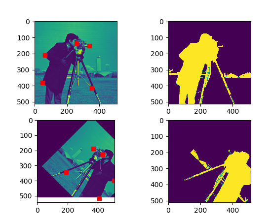
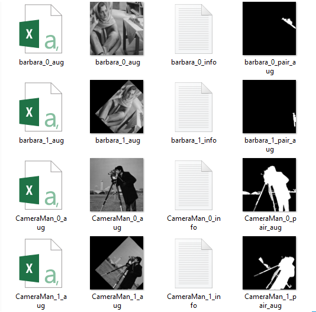

# Batch-augmentation-paired-images-plus-landmarks

# Image and keypoint augmentor
based on skimage and imgaug https://github.com/aleju/imgaug

# Files!

  - PrMain_single_image.py: use it as an example of augmentation on an image.
  - PrMain_batch_images.py: use it for batch processing.
 
# Easy for batch processing!
  - Set the source folders. input images and corresponding folders contain paired images and landmarks.
  - Set the destination folder.
  - It is assumed that, for each image in source folder, there is a csv file with same file name in landmark folder, consists the x, y locations of landmarks. see the example file.
  - It is assumed that, for each image in source folder, there is an paired image with same file name in the paired folder. see the example file.
  - Set the all augmentation variations in the AugCongigList list (based on imgaug syntaxes)
  - Execute it. 
  - All the augmented images (.png), corresponding keypoints (.csv) and information (.txt) will be saved in the destination folder.
 

An examples:

Destination Folder:

